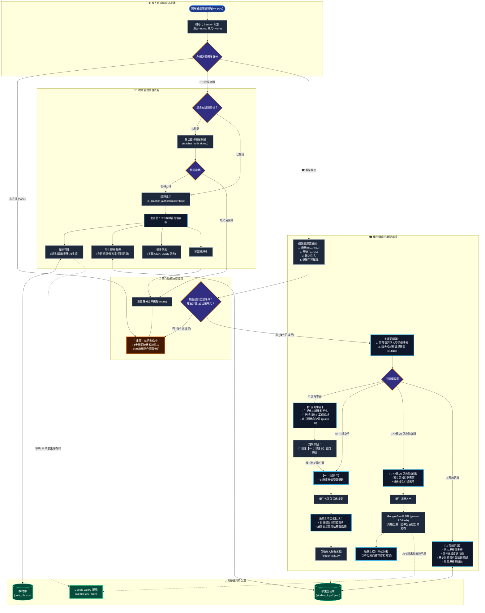

# 📑 CivilEdu_AI — 2026-10-04 本日完整開發紀錄檔 (Development Log)

**專案名稱**：CivilEdu_AI 國中公民思辨星系 ｜ AI 智慧自主學習館  
**開發日期**：2026-10-04  
**核心主題**：首頁進入防禦機制、全載具流體字級優化、經典標籤頁樣式還原、系統全面分析、Mermaid 流程設計圖與專案手冊重構  

---

## 🎯 一、 今日開發里程碑總覽 (Milestones Summary)

今日（2026-10-04）共完成 **6 個關鍵迭代階段 (Phase 19 ~ Phase 24)**，涵蓋前端互動邏輯、自適應響應式設計、Streamlit 1.59+ 底層適配、以及系統架構文件化：

| 階段 | 主題 | 核心成果摘要 |
| :--- | :--- | :--- |
| **Phase 19** | **首頁進入防禦與條件載入** | 實作 `is_student_ready` 四條件門檻（身分、班級座號、姓名非空、單元選定），首頁呈現即時動態檢核看板，防範未登記直接作答。 |
| **Phase 20** | **全載具自適應流體排版** | 導入 CSS `clamp()` 流體字級體系（`--fluid-*`），側邊欄重構為「班級/座號雙欄 + 姓名全寬」，徹底消除文字擠壓與首屏單元遮擋。 |
| **Phase 21** | **四大學習模組頁籤與標題放大** | 針對 `📖 開始學習`、`✏️ 小試身手`、`💬 公民 AI 助教隨身問`、`🌱 我的足跡` 進行醒目視覺強化，模組內頁標題同步特大化。 |
| **Phase 22** | **React-Aria 頁籤選擇器適配** | 深入 Streamlit 1.59+ `@react-aria/tabs` DOM 架構，覆蓋 `[data-testid="stTab"]` 與 `.react-aria-Tab` 內嵌小字號限制。 |
| **Phase 23** | **回復經典標籤頁導航樣式** | 依使用者回饋回復膠囊標籤頁本體（`border-radius: 999px`）與一體化水平基線，消除過度方塊化，純粹放大字級（19px~22px）。 |
| **Phase 24** | **系統全面分析與 Mermaid 流程圖** | 產出完整系統分析報告、標準化 Mermaid 網站流程設計圖，並重構 [`README.md`](file:///C:/Users/awen8/CivilEdu_AI/README.md) 為現代化專案說明手冊。 |

---

## 🛡️ 二、 階段 19：首頁進入防禦與學習資料條件載入重構

### 1. 需求背景
原系統於開啟網站時，預設身分為學生並立即於右側加載第一課講義與分頁，未引導學生登記班級姓名與選取單元，導致歷程歸檔缺乏鑑別度。

### 2. 技術實作架構 (`app.py`)
1. **身分初始狀態防護**：
   - `st.session_state.user_role` 初始為 `"none"`。
   - 側邊欄身分選單新增佔位項 `["請選擇操作身分...", "🎓 我是學生", "👨‍🏫 我是老師"]`。
2. **單元選擇防護**：
   - 下拉選單新增首項 `"-- 請選擇學習單元 --"`，`current_unit_id` 預設為 `None`。
3. **嚴格四條件展示門檻 (`is_student_ready`)**：
   ```python
   is_student_ready = (
       st.session_state.user_role == "student"
       and bool(st.session_state.student_name.strip())
       and (st.session_state.current_unit_id is not None)
   )
   ```
4. **即時動態「航行準備中」檢核看板**：
   - 未就緒時，主畫面動態顯示 4 大步驟完成狀態（未完成標示 ⏳，已完成標示 ✅），輔以星系特色功能簡介。
5. **首屏單元下拉選單視窗遮擋修復**：
   - 將側邊欄頂部內距由 `6rem` 緊湊化至 `1.2rem`，消除捲動條負擔，確保所有單元展開時 100% 完整直接呈現於第一屏。

---

## 🎨 三、 階段 20：全載具自適應流體排版與字體優化

### 1. 核心問題與成因
- **側邊欄三欄擁擠**：原先將班級、座號、姓名擠在同一行（`columns([1, 1, 1.4])`），各欄位僅 70~90px，導致標籤文字緊縮。
- **寫死小字體**：部分 HTML 標籤寫死為 `0.72rem` (約 11.5px) 或 `0.88rem` (約 14px)，在不同載具解析度下過小難讀。

### 2. 優化措施
1. **全載具自適應流體字級體系 (`:root`)**：
   - `--fluid-base`: `clamp(15.5px, 0.4vw + 14.5px, 17.5px)`
   - `--fluid-h1`: `clamp(1.75rem, 1.8vw + 1.25rem, 2.35rem)`
   - `--fluid-h2`: `clamp(1.45rem, 1.3vw + 1.1rem, 1.95rem)`
   - `--fluid-h3`: `clamp(1.22rem, 0.9vw + 0.95rem, 1.55rem)`
   - `--fluid-h4`: `clamp(1.1rem, 0.6vw + 0.95rem, 1.35rem)`
   - `--fluid-body`: `clamp(1.02rem, 0.35vw + 0.96rem, 1.16rem)`
   - `--fluid-sub`: `clamp(0.95rem, 0.25vw + 0.9rem, 1.05rem)`
2. **側邊欄學生基本資料排版重構**：
   - 第一列：`col_c, col_s = st.columns(2)` 放置班級與座號（各 ~140px，間距舒展無折行）。
   - 第二列：全寬姓名輸入框（~280px，輸入體驗寬敞）。
3. **全域元件防護**：
   - 全面覆蓋 Streamlit 各元件（`stRadio`, `stCheckbox`, `stSelectbox`, `stTextInput`, `stAlert`），保證正文皆不小於 16px、輔助字級不小於 15px。

---

## 🚀 四、 階段 21 ~ 22：頁籤選擇器修復與特色導覽升級

### 1. Streamlit 1.59+ 頁籤 DOM 根本原因分析
Streamlit 1.59 將頁籤底層由 BaseWeb 遷移至 `@react-aria/tabs`，頁籤本體轉為 `<div role="tab" data-testid="stTab" class="react-aria-Tab">`，且強制內嵌 `fontSize: 14px`。

### 2. 選擇器深度適配
全面覆蓋 `div[data-testid="stTabs"] [data-testid="stTab"]`、`[role="tab"]` 與 `.react-aria-Tab`，並設定 `height: auto !important`，徹底消除舊版選擇器無法命中問題。

---

## 🎯 五、 階段 23：回復經典標籤頁導航樣式與純粹放大字級

### 1. 調整動機
使用者回饋先前過度卡片化導致頁籤遺失「標籤頁」質感，變成獨立方塊連結。期望回復原本優雅純粹的標籤頁外觀，僅保留「加大字級」核心需求。

### 2. 優化成果
1. **回復經典標籤頁外觀**：
   - 移除厚重方框、深藍底色與大圓角，還原經典膠囊標籤頁（`border-radius: 999px`）。
   - 頁籤列下方具備一體連貫的柔和分隔線（`border-bottom: 1.5px solid var(--galaxy-line)`）。
   - 選中狀態呈現經典琥珀金下底線指示器（`border-bottom: 3px solid var(--galaxy-amber)`）。
2. **純粹字級加大（19px ～ 22px）**：
   - 頁籤文字字級設定為 `clamp(1.18rem, 0.35vw + 1.12rem, 1.32rem)`，字重 `600`（未選）/ `700`（選中）。
3. **還原特色功能導覽卡片與內頁標題**：
   - 首頁導覽卡片還原簡潔直觀的原版標題排版（`📖 白話重點 ＆ 直式心智圖` 等）。
   - 內頁各章節頂部標題還原為 `###`，風格清爽聚焦。

---

## 📊 六、 階段 24：系統全面分析、Mermaid 流程圖與專案手冊重構

### 1. 系統分析精華
- **3 大角色權限**：未就緒訪客（防禦導引）、學生端（4 大自主學習模組）、教師端（密碼驗證後台）。
- **4 條件啟航防禦機制**：身分 ➔ 班級/座號 ➔ 姓名非空 ➔ 單元選定。
- **4 大核心學習模組**：開始學習、小試身手（8 題素養情境）、AI 助教隨身問（Gemini 2.5 Flash）、我的足跡（歷程分析）。

### 2. 最新網站流程設計圖 (Mermaid Chart)


---

## 🛠️ 七、 今日修改檔案全清單

| 檔案名稱 / 路徑 | 類型 | 今日修訂總結 |
| :--- | :--- | :--- |
| [`app.py`](file:///C:/Users/awen8/CivilEdu_AI/app.py) | Python 主程式 | • 實作首頁 4 條件啟航防禦與即時動態檢核看板。<br>• 側邊欄頂部間距緊湊化與雙欄資料排版。<br>• 建立全載具自適應流體字級體系（`--fluid-*`）。<br>• 適配 Streamlit 1.59+ React-Aria 頁籤選擇器。<br>• 還原經典膠囊標籤頁導航外觀與純粹字級放大（19px~22px）。 |
| [`README.md`](file:///C:/Users/awen8/CivilEdu_AI/README.md) | 專案手冊 | • 全面更新為現代化專案說明手冊。<br>• 內嵌完整系統分析（角色、防禦機制、4大模組、技術堆疊）。<br>• 內嵌最新標準化 Mermaid 流程設計圖。 |
| [`DEVELOPMENT_LOG_20261004.md`](file:///C:/Users/awen8/CivilEdu_AI/DEVELOPMENT_LOG_20261004.md) | 本日日誌 | 本日開發完整詳細記錄檔（涵蓋階段 19 至 24 全部內容）。 |
| [`DEVELOPMENT_LOG.md`](file:///C:/Users/awen8/CivilEdu_AI/DEVELOPMENT_LOG.md) | 主開發日誌 | 全專案主開發歷程檔，同步追加階段 19 ~ 24 之歷程記錄。 |

---

## 🧪 八、 自動化測試與回歸驗證結果

1. **語法編譯檢查**：
   - 執行 `python -m py_compile app.py` ➔ 0 語法錯誤。
2. **Streamlit AppTest 全流程模擬**：
   - 訪客初始進入：驗證 `len(at.tabs) == 0`，未出現學習資料與分頁（通過）。
   - 學生基本資料未填：驗證 `len(at.tabs) == 0`，維持防禦看板（通過）。
   - 學生資料輸入完成：姓名輸入「王小明」並選定單元，驗證 `len(at.tabs) == 4`（通過）。
   - 跨頁程式化跳轉：由「開始學習」一鍵直達「小試身手」，狀態順暢切換（通過）。
3. **版本控制驗證**：
   - 所有變更皆透過 `dulwich` 乾淨 Commit，並成功推送至 GitHub `main` 分支。
