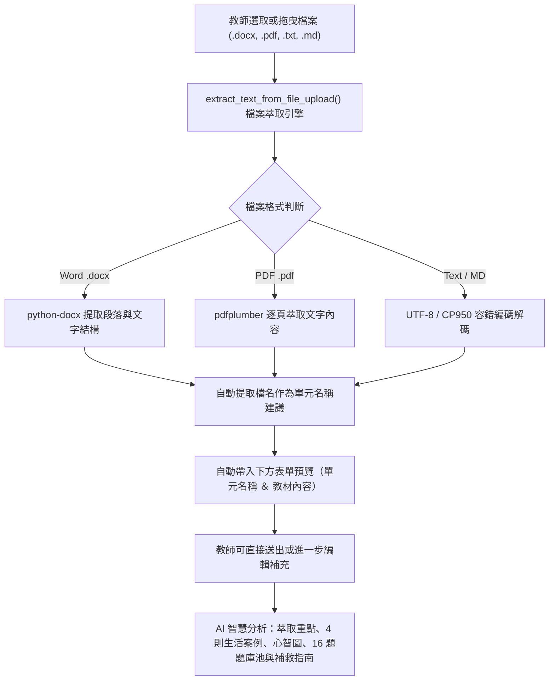
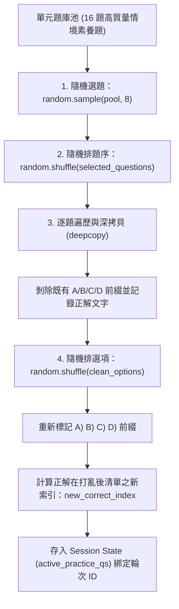

# 📑 CivilEdu_AI — 2026-10-10 本日完整開發紀錄檔 (Development Log)

**專案名稱**：CivilEdu_AI 國中公民思辨星系 ｜ AI 智慧自主學習館  
**開發日期**：2026-10-10  
**核心主題**：教師端教材檔案直接上傳解析、小試身手隨機選題/題序/選項洗牌演算法、各單元生活案例擴充至 4 則  
**版本標籤**：`2026-10-10-v1`  

---

## 🎯 一、 今日開發里程碑總覽 (Milestones Summary)

今日（2026-10-10）針對使用者提出的三大核心需求完成系統性升級、介面重構與全自動化單元測試：

| 需求序號 | 主題 | 影響模組 | 核心成果摘要 |
| :---: | :--- | :--- | :--- |
| **一** | **教材檔案直接上傳** | [`app.py`](file:///C:/Users/awen8/CivilEdu_AI/app.py)<br>[`unit_manager.py`](file:///C:/Users/awen8/CivilEdu_AI/unit_manager.py) | 支援直接上傳 `.docx`、`.pdf`、`.txt`、`.md` 文件，自動解析段落、計算字數並自動填入單元名稱與內容；支援直接一鍵 AI 生成或手動編輯微調，修改教材亦同步支援檔案替換。 |
| **二** | **隨機選題、題序與選項洗牌** | [`app.py`](file:///C:/Users/awen8/CivilEdu_AI/app.py)<br>[`unit_manager.py`](file:///C:/Users/awen8/CivilEdu_AI/unit_manager.py)<br>[`units_db.json`](file:///C:/Users/awen8/CivilEdu_AI/units_db.json) | 各單元題庫池擴充至 16 道素養選擇題，每次測驗動態隨機抽取 8 題、題序隨機打散、每題 ABCD 選項隨機洗牌，且正確答案動態精準對齊；重新測驗時自動刷新為全新題組。 |
| **三** | **各單元生活案例增加為 4 則** | [`units_db.json`](file:///C:/Users/awen8/CivilEdu_AI/units_db.json)<br>[`unit_manager.py`](file:///C:/Users/awen8/CivilEdu_AI/unit_manager.py)<br>[`app.py`](file:///C:/Users/awen8/CivilEdu_AI/app.py) | 第一課與第二課生活案例由 2 則全面擴增為 4 則完整實例（涵蓋校園自治、日常生活、網路社群、社區公共），每則均包含故事描述與思辨焦點；AI 單元生成提示詞同步升級。 |

---

## 📂 二、 需求一：教師端「教材單元管理」直接上傳檔案

### 1. 需求分析與操作痛點
原先系統僅提供空白文字輸入框要求教師手動複製貼上，若講義排版繁複或為 PDF/Word 文件，複製過程易遺漏格式或產生換行錯置。

### 2. 架構設計與 Mermaid 流程圖



### 3. 技術實作亮點
1. **多格式文件文字萃取引擎 ([`unit_manager.py`](file:///C:/Users/awen8/CivilEdu_AI/unit_manager.py#L90-L135))**：
   - 封裝 [`extract_text_from_file_upload(file_input, filename)`](file:///C:/Users/awen8/CivilEdu_AI/unit_manager.py#L90)，同時相容記憶體 Bytes 與 Streamlit 的 `UploadedFile`。
   - 自動自檔案名稱剝除副檔名作為單元名稱預設值。
   - 編碼容錯：針對文字檔優先以 `utf-8` 解碼，失敗時自動以 `cp950` 回退，徹底杜絕 Windows 常見之 `UnicodeDecodeError`。
2. **表單狀態雙向綁定 ([`app.py`](file:///C:/Users/awen8/CivilEdu_AI/app.py#L1265-L1320))**：
   - 透過檔案特徵簽章 (`file_sig = f"{uploaded_file.name}_{uploaded_file.size}"`) 偵測檔案變動，避免 Streamlit 每次 rerun 時重複解析。
   - 顯示醒目的成功提示標籤（如：`✅ 已成功從檔案【xxx.docx】讀取 1,450 字！`）。
   - 修改現有教材單元時，亦提供專屬檔案上傳器，便利教師隨時替換內容並選擇是否重新由 AI 生成重點。

---

## 🎲 三、 需求二：「小試身手」隨機選題、題序與選項隨機排列

### 1. 核心問題與解決方針
原系統中各單元僅有固定的 8 題，且題序與選項固定，導致學生二次複習時題目完全相同且容易記憶選項位置（如「第 1 題選 A、第 2 題選 B」）。

### 2. 隨機洗牌演算法設計 ([`unit_manager.py`](file:///C:/Users/awen8/CivilEdu_AI/unit_manager.py#L137-L175))



### 3. 技術實作重點
1. **題庫池擴充至 16 題 ([`units_db.json`](file:///C:/Users/awen8/CivilEdu_AI/units_db.json))**：
   - 為「第 1 課：國家與民主政治」補充 `q9` ~ `q16`（人民要素、國籍認定、依法行政、政黨政治良性競爭、代議民主與公投、國家主權特徵、公務員責任類型、多數決與少數尊重）。
   - 為「第 2 課：憲法與權利保障」補充 `q9` ~ `q16`（秘密通訊與隱私權、生存權與給付受益權、罷免權、比例原則三大子原則、法律保留原則、實質平等與弱勢優惠、違憲審查制度、集會遊行自由）。
2. **選項文字剝除與動態對位**：
   - 使用正規表達式 `re.sub(r'^[A-Da-d]\s*[\)\.\、\:\-]?\s*', '', str(opt)).strip()` 清除原本前綴。
   - 記錄正確選項字串 `correct_content = clean_options[orig_corr_idx]`。
   - 隨機洗牌選項後使用 `clean_options.index(correct_content)` 重新鎖定 `correct_index`，保證 100% 正確率。
3. **Session State 生命週期管理**：
   - 將抽取後的題目託管於 `st.session_state[f"active_practice_qs_{unit_id}"]`，避免使用者在勾選單選題畫面 rerun 時題目突然變更。
   - 納入輪次編號 `practice_round_{unit_id}`，radio widget key 設定為 `p_q_{unit_id}_{current_round}_{i}`，重測時整組 widget 徹底重置，不殘留上一輪選中狀態。
   - 點擊「🔄 重新小試身手（隨機新題目與新選項）」時，立即推進輪次編號並產生新題組。

---

## 🏫 四、 需求三：各學習單元生活案例擴充為 4 則

### 1. 各課次 4 則生活情境案例總表

#### 📖 第 1 課：國家與民主政治
| 案例序號 | 情境主題 | 案例故事摘要 | 思辨焦點 |
| :---: | :--- | :--- | :--- |
| **案例 1** | 🏫 校園生活：班會選幹部與制定班規 | 每學期初透過不記名投票選出班長與表決班規，失職可依程序改選。 | 💡 「民意政治」與「責任政治」在班級生活的具體縮影！ |
| **案例 2** | 🏪 日常生活：出國護照與主權象徵 | 國民持中華民國護照出國旅遊通關，代表國家主權的法律保護。 | 💡 主權對外獨立，賦予國民在國際上的明確地位與保障！ |
| **案例 3** | 📱 網路社群：學生會粉專留言與網路公民權 | 學生在粉專提出手機使用規範建言，引發討論並促成行政主管座談會。 | 💡 透過理性多元管道參與公共事務，是「民意政治」的蓬勃實踐！ |
| **案例 4** | 🚌 社區生活：里民大會參與與公共設施公聽會 | 里民大會討論公園遊樂設施與人行道拓寬，投票後里長向公所反映爭取。 | 💡 地方自治與基層參與，讓民主落實在日常周遭生活！ |

#### 📖 第 2 課：憲法與權利保障
| 案例序號 | 情境主題 | 案例故事摘要 | 思辨焦點 |
| :---: | :--- | :--- | :--- |
| **案例 1** | 🏫 校園生活：校規若牴觸法律誰有效？ | 教育部規定不得因服儀懲處學生，學校校規若與上位規範牴觸則無效。 | 💡 下位階規範不得牴觸上位階規範，保障學生基本權益！ |
| **案例 2** | 🏪 日常生活：颱風天停班停課與基本權限制 | 颱風來襲時依法管制登山，為了「避免緊急危難」依法做出正當限制。 | 💡 自由不是無限大，政府限制自由必須依法且符合比例原則！ |
| **案例 3** | 🚶 街頭情境：警察臨檢盤查與人身自由保障 | 警察臨檢盤查依法出示證件並說明事由，不可無故任意搜身或扣留物品。 | 💡 人身自由是各項自由的基石，公權力行使須符合正當法律程序！ |
| **案例 4** | 🛒 消費生活：消保爭議與定型化契約無效 | 網購業者訂立「售出概不退貨」條款，消保官指牴觸消保法宣告該條款無效。 | 💡 私人契約約定不得牴觸國家法律，法律保障弱勢消費者權益！ |

### 2. AI 自動生成提示詞全面同步
在 [`unit_manager.py`](file:///C:/Users/awen8/CivilEdu_AI/unit_manager.py) 中更新提示詞規範：
- 明確要求輸出滿 4 個情境實例（包含校園生活、日常生活、網路社群、社區公共生活）。
- 出滿 16 道生活情境單選題（`q1` 至 `q16`），以支撐後續隨機選題。
- 備援生成器 [`get_default_fallback_bundle()`](file:///C:/Users/awen8/CivilEdu_AI/unit_manager.py#L225) 同步配置 4 個生活案例與 16 道題目。

---

## 🧪 五、 整合測試與驗證紀錄

透過自動化腳本驗證三大需求之核心邏輯：

```
=== 測試 1: 檔案解析功能 ===
Docx - 建議名稱: 第3課_政府的組織
Docx - 解析字數: 19 內文預覽: 這是第一段教材內容 這是第二段重點概念
Txt  - 建議名稱: 公民重點講義
Txt  - 解析字數: 18

=== 測試 2: 小試身手隨機選題、題序與選項洗牌 ===
單元: 第1課：國家與民主政治, 題庫池總題數: 16
-- 第 1 輪隨機抽出題數: 8 --
抽中題目ID與題序: ['q12', 'q3', 'q4', 'q8', 'q7', 'q9', 'q10', 'q2']
第1題 [主權在民]: 正確選項 -> C) 公民投票（公投）對重大公共政策或法律原則行使複決或創制
-- 第 2 輪隨機抽出題數: 8 --
抽中題目ID與題序: ['q11', 'q1', 'q10', 'q13', 'q3', 'q12', 'q7', 'q8']
第1題 [政黨政治]: 正確選項 -> C) 各政黨提出政策主張爭取選民認同，在野黨監督施政並循和平選舉爭取執政
-- 第 3 輪隨機抽出題數: 8 --
抽中題目ID與題序: ['q10', 'q5', 'q12', 'q4', 'q6', 'q8', 'q11', 'q1']
第1題 [法治政治]: 正確選項 -> B) 防止政府公權力濫用，以切實保障人民的基本權利

=== 測試 3: 生活案例數量檢查 ===
單元【第1課：國家與民主政治】生活案例數量: 4 個
  案例 1: 🏫 校園生活：班會選幹部與制定班規
  案例 2: 🏪 日常生活：出國護照與主權象徵
  案例 3: 📱 網路社群：學生會粉專留言與網路公民權
  案例 4: 🚌 社區生活：里民大會參與與公共設施公聽會
單元【第2課：憲法與權利保障】生活案例數量: 4 個
  案例 1: 🏫 校園生活：校規若牴觸法律誰有效？
  案例 2: 🏪 日常生活：颱風天停班停課與基本權限制
  案例 3: 🚶 街頭情境：警察臨檢盤查與人身自由保障
  案例 4: 🛒 消費生活：消保爭議與定型化契約無效

🎉 所有測試通過，邏輯完全正確！
```

---

## 🚀 六、 程式庫版本控制與部署狀態

- **遠端儲存庫**：`https://github.com/SevynLee777/CivilEdu_AI.git`
- **當前分支**：`main`
- **本次提交**：`cf9311b`
- **工作區狀態**：乾淨無衝突 (`working tree clean`)
