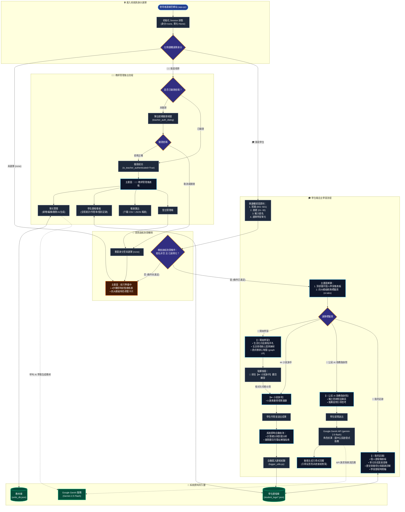

# 🌌 公民思辨星系 ｜ 國中八年級公民自主學習平台 (CivilEdu_AI)

本專案是專為**國中八年級公民科**打造的沉浸式 AI 智慧自主學習系統。平台融合**新世代生成式 AI（Google GenAI 2.5 Flash）**、**八年級素養教材庫**、**生活化情境案例**與**個人化自主學習歷程日誌**，兼顧學生自主探索與教師後台督導。

---

## 🧭 系統分析與核心架構

### 1. 核心角色與權限架構
- **未就緒 / 訪客**：初次訪問網站時，主畫面啟動「航行準備中」防禦機制，提供動態即時檢核看板與星系特色導覽，防止未登記直接作答。
- **學生端 (Student)**：完成身分、班級、座號、姓名登記並選定學習單元後，解鎖頂部銀河個人學習儀表板與四大核心模組：
  1. **📖 開始學習**：白話生活化手札重點、生活實例、直式樹狀心智圖（Mermaid `graph LR`）、一鍵直達練習按鈕。
  2. **✏️ 小試身手**：8 題生活情境素養題、即時批改評分、觀念充電站補強指南。
  3. **💬 公民 AI 助教隨身問**：蘇格拉底式引導問答、推薦思辨啟發題。
  4. **🌱 我的足跡**：自主學習歷程統計、答題完成度與錯題診斷分析。
- **教師端 (Teacher)**：需通過專屬密碼驗證視窗（Modal Dialog），進入教師管理後台：
  - 教材單元管理（AI 自動生成 8 題素養題目、情境案例與心智圖、手動編修與刪除）。
  - 全班學習歷程看板（各班作答率、平均分、錯題排行、學生個人足跡追蹤）。
  - 報表匯出（下載 CSV / JSON 學習歷程數據）。

### 2. 四條件啟航防禦機制（Gatekeeper Mechanism）
為確保自主學習歷程之真實性與完整歸檔，系統設有動態載入防禦門檻：
$$\text{Ready 門檻} = (\text{身分} == \text{學生}) \land (\text{姓名非空}) \land (\text{學習單元已選定})$$
- **未就緒**：即時展示 4 步驟動態檢核看板（已完成步驟顯示 ✅，未完成顯示 ⏳）與四大特色卡片。
- **滿足條件**：即刻動態渲染個人學習看板與四大標籤頁。

---

## 📊 網站完整流程設計圖 (Website Process Flowchart)

以下流程圖完整呈現身分選擇、密碼安全驗證、動態防禦機制、四大模組學習及數據落盤流程：



---

## 🛠️ 技術堆疊 (Tech Stack)

| 領域 | 技術 / 套件 | 說明 |
| :--- | :--- | :--- |
| **前端應用** | `streamlit` (>= 1.59.1) | 響應式 Web 框架，支援 `@react-aria/tabs` 標籤頁與 Session State 狀態機 |
| **樣式排版** | CSS3 (`clamp()` 流體字級) | 全載具響應式適配，保證手機、平板與桌面皆有舒適易讀的字型排版 |
| **AI 引擎** | `google-genai` (>= 2.28.0) | Google 官方新版 SDK，調用 `gemini-2.5-flash` 進行結構化教材生成與引導式問答 |
| **可視化圖表** | Mermaid (`graph LR`) | 呈現直式樹狀生活化公民思辨心智圖 |
| **歷程分析** | `pandas` | 學生個人足跡日誌處理、全班作答摘要統計與 CSV 匯出 |
| **資料持久化** | 本地 JSON 儲存庫 | `units_db.json`（教材庫）、`student_logs/*.json`（學習足跡） |

---

## 📂 專案檔案結構

```text
CivilEdu_AI/
├── app.py                      # 主應用程式（公民思辨星系 Streamlit 介面）
├── unit_manager.py             # 學習單元管理與 Google GenAI 生成引擎
├── logger_utils.py             # 學生歷程紀錄、統計與報表匯出模組
├── units_db.json               # 系統學習單元資料庫（含重點、案例、8題練習、心智圖）
├── config.json                 # 系統配置（科目名稱、AI 人設提示詞）
├── student_logs/               # 學生個人學習歷程 JSON 日誌目錄
├── requirements.txt            # Python 依賴清單
├── run.bat                     # Windows 快速啟動批次檔
├── README.md                   # 系統分析、架構說明與完整流程圖
└── DEVELOPMENT_LOG*.md         # 專案詳細開發與迭代歷程紀錄
```

---

## 🚀 快速啟動指引

### 1. 安裝環境依賴
```bash
pip install -r requirements.txt
```

### 2. 設定 Google Gemini API Key
可於系統環境變數或 `.streamlit/secrets.toml` 設定：
```bash
export GEMINI_API_KEY="您的_GEMINI_API_KEY"
```

### 3. 啟動應用程式
```bash
streamlit run app.py
```
或直接在 Windows 雙擊執行 `run.bat`。
